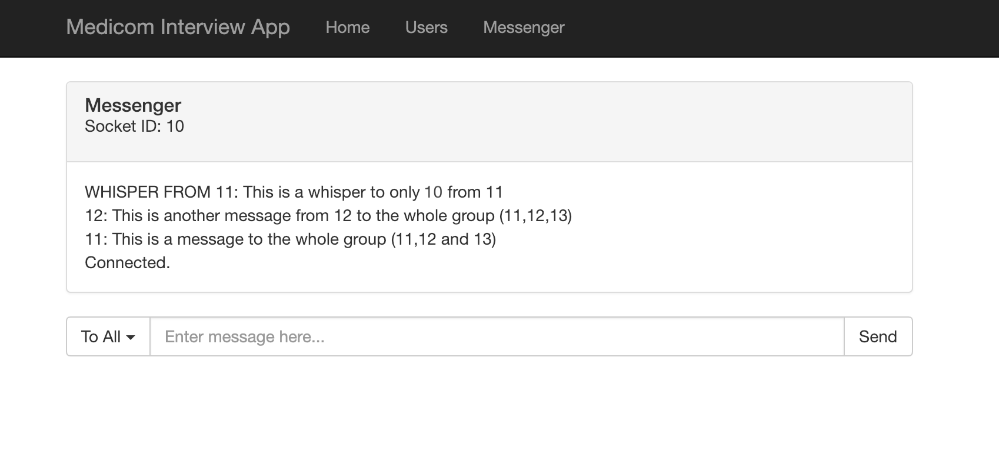

# medicom-test-app

This test application has the following:
A websocket server which is used for a messenger
* Users can broadcast messages to everyone
* When users leave, the messages that they have sent look inactive
* Resources: https://www.npmjs.com/package/ws, https://developer.mozilla.org/en-US/docs/Web/API/WebSockets_API/Writing_WebSocket_client_applications

A table of users
* seeded with first name, last name, email, and profile pic
* table is associated with a table of actions through a many to one association
* Resources: http://docs.sequelizejs.com/

A mocha tests
* run using ```mocha test```
* Resources: https://mochajs.org/, http://www.chaijs.com/api/bdd/

Working on this project:
1. Make sure that a version of node is installed. (Last tested on v12.13.0: https://nodejs.org/download/release/v12.13.0/)
2. Fork this repository
3. Clone your repository to your machine
4. Go to the directory where you cloned this repository and ```npm install``` the node modules
5. Make sure that mariaDB is downloaded and installed (macOS: https://mariadb.com/kb/en/library/installing-mariadb-on-macos-using-homebrew/
win: https://mariadb.com/downloads/)
6. Create two databases: database_development and database_test (https://dev.mysql.com/doc/refman/8.0/en/create-database.html)
7. Run ```npm install -g sequelize-cli``` (https://www.npmjs.com/package/sequelize-cli)
8. Run ```sequelize db:migrate``` to migrate the tables to your databases
9. Run ```sequelize db:seed:all``` to seed your tables with pre-made data
10. Run ```npm start``` to run the application. It will run at http://localhost:3000. To debug the server, run ```npm run debug``` instead of ```npm start```. Go to chrome://inspect to inspect the server.
11. Work through the following tasks:
    - Users should be able to whisper (send to only one) messages to online users
    
    - A user should be able to add a user
    
    - The table of users should display profile pic in table
    
    - The table of users should have "actions" that can be associated with users
        * These can be buttons next to the user in the "Actions" column
        * Actions can include "Eat", "Sleep", "Drink"
    - The table of users should display how many times those actions have been performed
        * Next to the button, display a counter
        * These counters must be permanent. A refresh will not clear them.
    - Add 2 more mocha tests based on either api or models
12. When the above are complete or you are unable to complete the rest of the tasks, create a pull request into this repository.

Folder Structure:
```
+- .idea - used if you have an JetBrains IDE
+- bin - runs the server
+- config - holds configuration files including DB config files
+- migrations - holds sequelize migrations including initial table creation
+- models - holds sequelize schemas for actions and users
+- modules - holds different modules that are used by the web application
|  +- constants - holds the constants used by the web application
|  +- logger - holds the logging module
+- profilePics - holds files for the users' profile pics
+- public - holds static web files
|  +- javascripts - holds the javascript files used by the webpages
|  |  +- displayUsers - used by the /displayUsers page to get and push data to the api
|  |  +- helpers - used by all pages, stores functions that can be of use anywhere
|  |  +- messenger - used by the /messenger page to set up the messenger
|  +- stylesheets
|     +- style.scss - used by all pages, used to generate the style.css file
+- routes - holds the express web application routes include / and /users
+- seeders - holds the sequelize data seeders
+- test - holds the tests that are run by mocha to run
|  +- api - holds the tests that are run against the api
|  +- models - holds the tests that are run against the sequelize models
+- views - holds the ejs files that are used on the various pages
+- websocket - holds the websocket server
+- .editorconfig - configures how the editor should set tabs and end of file
+- .eslintrc.js - configures how the editor should lint these files
+- app.js - builds the express app
```
